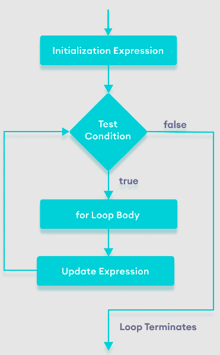

### JavaScript for loop, while loop
loops are used to repeat a block of code.

** 1. JavaScript for loop**
The syntax of the **for** loop is:

```node
for (initialExpression; condition; updateExpression) {
    // for loop body
}
```
Here,

1. The **initialExpression** initializes and/or declares variables and executes only once.
2. The **condition** is evaluated.
	- If the condition is **false**, the **for** loop is terminated.
	- If the condition is **true**, the block of code inside of the **for** loop is executed.
3. The **updateExpression** updates the value of **initialExpression** when the condition is true.
4. The **condition** is evaluated again. This process continues until the condition is **false**.



**Flowchart of JavaScript for loop**

**Example 1: Display a Text Five Times**

```node
// program to display text 5 times
const n = 5;

// looping from i = 1 to 5
for (let i = 1; i <= n; i++) {
    console.log(`I love JavaScript.`);
}
```
**Output**

```node
I love JavaScript.
I love JavaScript.
I love JavaScript.
I love JavaScript.
I love JavaScript.
```

**Here is how this program works**

| Iteration | Variable | Condition: i <= n | Action |
| --- | ---- | -------- | -------- |
| 1st | i = 1, n = 5 | true | **I love JavaScript.** is printed. **i** is increased to **2**. | 
| 2nd | i = 2, n = 5 | true | **I love JavaScript.** is printed. **i** is increased to **3**. | 
| 3rd | i = 3, n = 5 | true | **I love JavaScript.** is printed. **i** is increased to **4**. | 
| 4th | i = 4, n = 5 | true | **I love JavaScript.** is printed. **i** is increased to **5**. | 
| 5th | i = 5, n = 5 | true | **I love JavaScript.** is printed. **i** is increased to **6**. | 
| 6th | i = 6, n = 5 | false | The loop is terminated. | 

**Example 2: Display Numbers from 1 to 5**

```node
// program to display numbers from 1 to 5
const n = 5;

// looping from i = 1 to 5
// in each iteration, i is increased by 1
for (let i = 1; i <= n; i++) {
    console.log(i);     // printing the value of i
}
```
**Output**

```node
1
2
3
4
5
```

**Here is how this program works**

| Iteration | Variable | Condition: i <= n | Action |
| --- | ---- | -------- | -------- |
| 1st | i = 1, n = 5 | true | **1** is printed. **i** is increased to **2**. | 
| 2nd | i = 2, n = 5 | true | **2** is printed. **i** is increased to **3**. | 
| 3rd | i = 3, n = 5 | true | **3** is printed. **i** is increased to **4**. | 
| 4th | i = 4, n = 5 | true | **4** is printed. **i** is increased to **5**. | 
| 5th | i = 5, n = 5 | true | **5** is printed. **i** is increased to **6**. | 
| 6th | i = 6, n = 5 | false | The loop is terminated. | 

**Example 3: Display Sum of n Natural Numbers**

```node
// program to display the sum of natural numbers
let sum = 0;
const n = 100

// looping from i = 1 to n
// in each iteration, i is increased by 1
for (let i = 1; i <= n; i++) {
    sum += i;  // sum = sum + i
}

console.log('sum:', sum);
```

**Output**

```node
sum: 5050
```

Here, the value of **sum** is **0** initially. Then, a **for** loop is iterated from **i = 1 to 100**. In each iteration, **i** is added to **sum** and its value is increased by **1**.

When **i** becomes **101**, the test condition is **false** and **sum** will be equal to **0 + 1 + 2 + ... + 100**.


**JavaScript Infinite for loop**

If the test condition in a for loop is always true, it runs forever (until memory is full). For example,

```node
// infinite for loop
for(let i = 1; i > 0; i++) {
    // block of code
}
```

** 2. while loop**

```node
let x = 10;
while(x > 0){
    x = x-1;
    if(x%2 == 0){
        console.log('even', x)
        continue;
    }
    console.log('odd', x);
}
```

** 3. Do while loop**

```node 
var i = 20;
do{
    console.log(i);
    i++;
}while(i <= 25)
```

**Output**

```node
20
21
22
23
24
25
```

** 4. for-in loop**

```node
j = {name: "mern", type: 'course', lang: 'javascript'}
for(let k in j){
    console.log(k)
}
j = {name: 'mern', type: 'course', lang: 'javascript'}
for(let k in j){
    console.log(j[k]);
}
```


**Reference**

[JavaScript Loops Explained](https://www.freecodecamp.org/news/javascript-loops-explained-for-loop-for/)
[JavaScript Loops](https://www.javatpoint.com/javascript-loop)