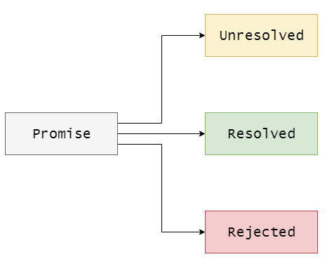
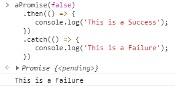
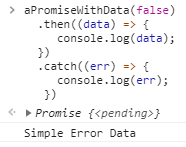
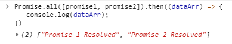
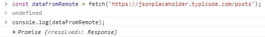
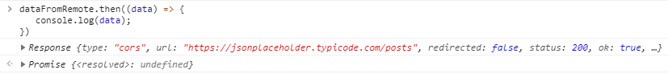
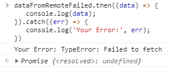

### JavaScript Promise
JavaScript Promise


**JavaScript Promise ?**

We know about JavaScript's asynchronous behavior. Instead of waiting for a remote server or an operation that takes some time to complete, JavaScript moves on to the next operation. Such operations are asynchronous operations. Now if you skip this operation and move on to another operation, JavaScript keeps track of that as well. And this is why JavaScript uses Promise.



**Making a promise:**

```node 
        const aPromise = control => {
            return new Promise((resolve, reject) => {
                setTimeout(() => {
                    if(control){
                        resolve();
                    }else{
                        reject();
                    }
                }, 3000)
            })
        }
```

```
aPromise(true);
```

You should see an output something like this:


**Handling Promises**

Now we will handle whether the promise succeeded or failed. In that case if the promise is successful then we can chain it **aPromise** with our function and **.then()** provide a callback function here, which **resolve** will run if the promise succeeds or in other words:

```node
aPromise(true)
  .then(() => {
     console.log('This is a Success');
  })
```

This will make our callback run as a **true** promise after three seconds given as an argument:**resolve**

And if the promise is rejected then we have **.catch()** to handle it with a callback function in another chain operation. Now we don't know whether the operation will succeed or fail. In that case we have to keep the **.then()** other **.catch()** two. .catch()Will run for any reason if our promise **reject** is:

```node 
aPromise(false)
  .then(() => {
     console.log('This is a Success');
  })
  .catch(() => {
     console.log('This is a Failure');
  })
```
Since I have given the argument here **false**, it will be from the promise **reject**. And so after 3 seconds the operation completes and **catch** the callback inside the block will run:



Here first, we **aPromise** do not need to write the part of creating the promise with the function we returned the promise. Rather, in the system we use to exchange data, or use the library, this part is coded when and how to promise **resolve** or **reject** do these things. In most of our cases we have to handle returned promises with **.then()**  **.catch()**. Again, the callbacks that are used inside, in most cases, the data we want from the remote server comes as an argument in those callbacks. We can access them with that argument from inside the callback. For example, by slightly modifying the previous promise, we can send data from **resolve()** or to:**reject()**

```node
const aPromiseWithData = control => { 
   return new Promise((resolve, reject) => {
      setTimeout(() => {
         if(control) {
            resolve('Simple Success Data');
         } else {
            reject('Simple Error Data');
         }
      }, 3000)
   })
}
```
Here we can access the data from the or callback exactly as it was sent by accepting it as an **resolve()** argument **reject()**: **.then()** **.catch()**

```node
aPromiseWithData(true)
  .then((data) => {
     console.log(data);
  })
```

Notice that this data comes from our promise, then passes through here **resolve()** as an **.then()** argument to its callback, which we can then access and print:

**reject** Even if promised similarly :

```node 
aPromiseWithData(false)
  .then((data) => {
     console.log(data);
  })
  .catch((err) => {
     console.log(err);
   })
```



**Handling Multiple Promises: At times we may need to handle multiple promises as well. For example, we have two promises:**

```node
const promise1 = new Promise((resolve, reject) => {
   setTimeout(() => {
      if(true) {
         resolve('Promise 1 Resolved');
      } else {
         reject('Promise 1 Error');
      }
   }, 5000)
 })
```

We can also create promises directly like this. I made another promise below:

```
const promise2 = new Promise((resolve, reject) => {
   setTimeout(() => {
      if(true) {
         resolve('Promise 2 Resolved');
      } else {
         reject('Promise 2 Error');
      }
   }, 5000)
})
```
Now if we want to perform an operation after these two promises are complete, we can take the two promises as an array like this:

```
Promise.all([promise1, promise2]);
```

Then **.then()** we can call the callback which will run after these two promises complete. And the data from these promises will come in the form of an array to this callback function:

```node 
Promise.all([promise1, promise2]).then((dataArr) => {
   console.log(dataArr);
})
```

By the way, once the time of setTimeout is over, you will see the result of your promise:



**fetch() API**

Now we will get the data from the real remote server and work with it, for that we fetch()will use the browser API. The job of this API is to fetch resources from an external remote server. This part will not work directly in NodeJS. Although there are better libraries than NodeJS, we will use it here since it is built-in in modern browsers. Now this fetch()API handles the promise return process itself. We just need to handle the returned promise. We will bring some fake data from remote server one by one

```node
const dataFromRemote = fetch('https://jsonplaceholder.typicode.com/posts');
```

```
console.log(dataFromRemote);
```



Yes! It's a promise. Now we can **.then().catch** easily handle it with ease. And this fetch API **.then** passes the fetched data as an argument to its callback. And if there is an error, **.catch** it passes as an argument to its callback:

Now you **data** can see some data here. resolveThese are some of the success type data due to your promise :



Now, due to the complex structure of the fetch API, the original fetched data is not here, but basically the data resolveafter our promise is shown here. But no problem, there are many other libraries better than Fetch API which are actually the ones we will use the most in our development. Now if for some reason we send a wrong request with the fetch api:

```
dataFromRemoteFailed.then((data) => {
   console.log(data);
}).catch((err) => {
   console.log('Your Error:', err);
})
```



Now if our promise is **resolve** done but there **catch** is no need for blocks. But it's also not good practice to **catch** handle all promises in your application without blocking. Errors can occur for any reason. And so **catch** it is good practice to keep this block and handle it.

**Retrieving original data**

A little while ago we made a request to fetch data from another place with the fetch API, but we have not seen the actual data yet. This is due to the complex structure of the Fetch API. But anyway one thing is good that now we will see how to recover real data from here, and also we will introduce another new problem here. We will access our data

```
fetch('https://jsonplaceholder.typicode.com/posts')
   .then((data) => {
      return data.json();
   }).then((posts) => {
      console.log(posts);
})
```


**Reference**

[Call Stack](https://github.com/priya42bagde/33-js-concepts#1-call-stack)
