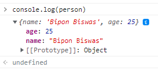

## Typescript

### 2.1 Basic Type

#### Data types in TypeScript

Since, TypeScript is a superset of JavaScript. Therefore, TypeScript inherits JavaScript's built-in data types and adds some additional data types.


1. Primitive data type

2. Non-primitive data type

#### Primitive data type
- Boolean
- Number
- String
- Null
- Undefined
- Void
- Any
#### Non-primitive data type
- Array
- Class
- Function
- Tuple
- Interface
- Enum
- Generic
- Decorators

**Boolean**

```node
let isDied: boolean = false;
```

**Number**

```node
let decimal: number = 6;
let hex: number = 0xf00d;
let binary: number = 0b1010;
let octal: number = 0o744;
let big: bigint = 100n;
```

**String**
```node
let color: string = “Gray”;
```

**null and undefined**
```node
let counter: number = null;
let isDied: boolean = null;
let name: string = null;
```

**undefined**
```node
let counter: number = null;
let isDied: boolean = null;
let name: string = null;
```

**Void**
```node
function getInfo(firstName: string, lastName: string): void {
console.log(`${firstName} ${lastName}`);
}
```

**any**
```node
let anyValue: any;
anyValue = 420;
anyValue = “Bangladesh”;
anyValue = true;
```

**array**
First, you need to decide which data type to use and use [] with that type:
```node
let list: number[] = [45, 41, 220];
```
The second way is by using a generic array type:
```node
let list: Array<number> = [45, 41, 220];
```


But now if we want to access this **local** variable **localScope()** somewhere outside this or any other function, then it cannot be accessed and in this case we will get real error.

```node 
function localScope() {
   var local = 'I am local to my own function';
   console.log(local);
}

localScope();

console.log(local);
```


```
aPromise(true);
```

**Global (Global) Scope**

If the variable is not declared inside a function, then it is a variable declared in the global scope, that means the variable declared anywhere outside the function will get the global scope. They are also called global variables. Global variables can be accessed from within any function or from anywhere

```node
var globalVar = 'I am a Global Variable';

function globalScope() {
   console.log('Inside a Function: ' + globalVar);
}

globalScope();

console.log('Outside: ' + globalVar);
```


Now this idea of ​​scoping applies to variables as well as to functions and objects.

This means that if you declare a function in global scope, you can access it from anywhere globally. All the functions used in the above examples are declared in global scope.

```node
function globalFunc() {
   console.log('Global Function');
}
```

Now calling this function will work fine:

```node
globalFunc();
```


Similarly if you declare another function inside a function then the function declared inside the function gets the local scope of that function. And this function can only be called inside that function. Can't call outside as it has no scope.


```node 
function anoGlobalFunc() {
   console.log('Global Function');
   function localFunc() {
      console.log('Local Function');
   }
   localFunc();
}
```
Note that I called the local function **localFunc()** inside that function, because that's where it's scope is. Now calling the global function **anoGlobalFunc()** will execute both.


```node
anoGlobalFunc();
```


 **localFunc()** But now if I call this local function  **anoGlobalFunc()** outside it will show error:


```
localFunc();
```


Same goes for the same object. When declared inside a function, it gets the local scope of that function. Cannot be accessed anywhere except inside the function itself. And if declared outside global scope it will get global scope and can be accessed from everywhere.

```node 
var person = {
   name: 'Bipon Biswas',
   age: 25
}
```

Now this object can be accessed from everywhere:

```node
console.log(person);
```




But if this object is declared inside a function, then that object gets local scope of that function and can be accessed only from inside that function.

```node
function objectFunc() {
   var localObj = {
      name: 'Bipon Biswas',
      age: 25
   }
   console.log(localObj);
}
```
Now calling this function will show everything fine:

```node
objectFunc();
```


```node
console.log(localObj);
```


**Lexical Scoping (Lexical Scoping)**

In lexical scoping, a relation of a parent function with a child function is created. Now what does parent-child function mean? Yes, if we declare another function inside a function, then the function inside which we declared the new function is the parent function. And any other function declared inside the parent function is a child function of that parent function. Hope the following example will clear the idea:

```node
function parentFunction() {
   //some codes here
   function childFunction() {
      //some more codes
   } 
}
```
Now here is the **parentFunction()** global function and **childFunction()** **parentFunction()**  its local function. Now we know that variables, functions or objects declared inside a function get local scope and can be accessed only inside that function. But because of lexical scoping, **parentFunction()** anything local declared inside here can be accessed from **parentFunction()** within it, and all of its child functions **childFunction()** can also be accessed from inside here.

```node
function parentFunction() {
   var a = 9;
   function childFunction() {
      var b = 11;
      console.log('Sum: ' + (a + b));
   } 
   childFunction();
}
```
Now **parentFunction()** calling K will show the result exactly as it should:

```node
parentFunction();
```


**Another example**

``` node
function parentFunction(){
    var a = 9;
    function childFunction(){
        var b = 11;
        // console.log('Sum : ' + (a+b))
        function childFunctionC(){
            var c = 10
            console.log('Sum3 : ' + (a + b + c))
        }
        childFunctionC()
    }
    childFunction();
    
}
parentFunction()
```

**Output**

``` node
Sum3 : 30
```


**Reference**

[BLOCK SCOPE & Shadowing in JS ](https://www.youtube.com/watch?v=lW_erSjyMeM)
